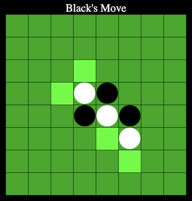

# [Play it!](./)

# What is Reversi ?
Reversi or Othello is a strategy board game, play on  8x8  board grids.  

  

# Rules
- Each reversi piece (or disc) has two sides, one side is white and the other is black. 
- Each side corresponds to one player.
- Black goes first and the players make moves alternately. 
- A move consist of a player placing a piece with correspond color facing up.
- Each move must flank at least one opponent's piece.
- Flanking is done by sandwiching opponent's piece(s) between newly placed piece and one (or more) of other own pieces.
- Flanking can be made by vertically, horizontally and diagonally.
- Player without a legal move passes.
- If no player can make a legal move, the game is over.
- Player who owns more pieces at the end of the game wins.